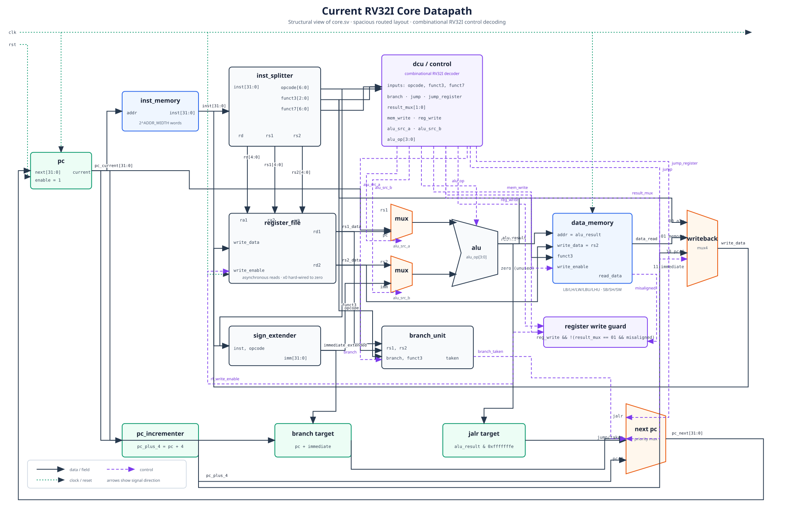

# RV — núcleo RISC-V RV32I em SystemVerilog

Este projeto implementa um processador RISC-V de 32 bits para fins didáticos, descrito em SystemVerilog e preparado para execução em uma placa Terasic DE0 com FPGA Cyclone III. A proposta é manter o caminho de dados pequeno, legível e fácil de observar: cada instrução percorre busca, decodificação, execução, acesso à memória e writeback em um único ciclo.

Além da simulação automatizada, o projeto oferece um modo de demonstração na placa em que cada toque de botão avança exatamente uma instrução. Os switches selecionam um registrador e os displays de sete segmentos exibem seu conteúdo, permitindo acompanhar a execução de um programa sem ferramentas externas de depuração.



## Visão geral da arquitetura

O núcleo segue uma organização Harvard simples, com memórias separadas para instruções e dados. O estado arquitetural é formado pelo contador de programa, pelos 32 registradores inteiros e pela memória de dados. O sinal `enable` controla todas as mudanças de estado relevantes, possibilitando tanto execução contínua em simulação quanto execução passo a passo na placa.

O caminho de uma instrução é:

1. O PC endereça a memória de instruções.
2. A instrução é separada em opcode, registradores e campos de função.
3. A unidade de controle gera os sinais do caminho de dados.
4. O imediato é reconstruído e estendido para 32 bits.
5. A ALU executa a operação ou calcula um endereço.
6. Branches e jumps escolhem o próximo PC.
7. Loads, resultados da ALU, `PC + 4` ou imediatos retornam ao banco de registradores.

Por ser monociclo, não há pipeline, hazards ou forwarding. Essa escolha privilegia clareza e facilidade de depuração em vez de frequência máxima.

## Funcionalidades

- Conjunto base RV32I com registradores e dados de 32 bits.
- Banco com 32 registradores, mantendo `x0` fixo em zero.
- Leitura assíncrona e escrita síncrona no banco de registradores.
- ALU com soma, subtração, operações lógicas, comparações com e sem sinal e shifts.
- Imediatos dos formatos I, S, B, U e J.
- Branches `BEQ`, `BNE`, `BLT`, `BGE`, `BLTU` e `BGEU`.
- Jumps `JAL` e `JALR`, incluindo gravação de `PC + 4`.
- Loads `LB`, `LH`, `LW`, `LBU` e `LHU`.
- Stores `SB`, `SH` e `SW`.
- Instruções aritméticas e lógicas com registrador ou imediato.
- Suporte a `LUI` e `AUIPC`.
- Detecção de loads e stores desalinhados.
- Memórias de instruções e dados parametrizáveis por `ADDR_WIDTH`.
- Inicialização da memória de instruções por arquivo hexadecimal com `$readmemh`.
- Entrada de debug para leitura independente de qualquer registrador.
- Testes automatizados dos módulos e de programas RV32I completos.

## Execução na DE0

O módulo `de0_top` conecta o núcleo aos recursos da placa:

| Recurso | Função |
| --- | --- |
| `BUTTON[0]` | Avança uma instrução após debounce e sincronização |
| `BUTTON[1]` | Reset ativo em nível baixo |
| `SW[4:0]` | Seleciona o registrador `x0` a `x31` |
| `SW[5]` | Seleciona os 16 bits inferiores ou superiores |
| `HEX0`–`HEX3` | Exibem em hexadecimal a metade selecionada do registrador |

Os pontos decimais permanecem desligados. Por padrão, a imagem carregada é `programs/fibonacci.hex`. As atribuições de pinos e os parâmetros do Cyclone III estão em `rv.qsf`, e as restrições de timing estão em `rv.sdc`.

## Estrutura do projeto

```text
.
├── core.sv                 # integração do caminho de dados
├── dcu.sv                  # unidade combinacional de controle
├── alu.sv                  # unidade lógica e aritmética
├── register_file.sv        # registradores x0–x31
├── inst_memory.sv          # memória de instruções
├── data_memory.sv          # memória de dados e alinhamento
├── de0_top.sv              # integração com a placa DE0
├── button_debouncer.sv     # entrada de passo manual
├── hex7seg.sv              # conversor hexadecimal para sete segmentos
├── programs/               # exemplos em assembly e imagens hexadecimais
├── test/                   # testes e fixtures
├── compile_program.sh      # geração de imagens para $readmemh
└── run_tests.sh            # compilação e execução da suíte
```

Os demais módulos implementam separação de campos, extensão de imediatos, branches, multiplexadores e atualização do PC.

## Testes

Os testes usam Icarus Verilog com suporte a SystemVerilog. Para executar toda a suíte:

```sh
./run_tests.sh
```

O runner descobre automaticamente os arquivos `test/test_*.sv`, compila cada módulo de teste de forma isolada e executa a simulação com `vvp`. A cobertura inclui unidades individuais, integração do caminho de dados, interface da DE0 e execução do programa de Fibonacci.

Requisito:

- `iverilog` e `vvp` disponíveis no `PATH`.

## Compilação de programas

Os exemplos em `programs/` são escritos em assembly RISC-V e usam `_start` como ponto de entrada. O script aceita uma fonte `.S` e, opcionalmente, o caminho da imagem de saída:

```sh
./compile_program.sh programs/fibonacci.S programs/fibonacci.hex
```

Sem o segundo argumento, a saída é gravada em `program.hex`:

```sh
./compile_program.sh programs/sum.S
```

O script gera código para `rv32i`/`ilp32`, extrai a seção `.text` e converte cada instrução little-endian para o formato esperado por `$readmemh`. Ele procura, nesta ordem, uma toolchain GCC RISC-V ou Clang com LLD e `llvm-objcopy`. As variáveis `CC` e `OBJCOPY` podem selecionar ferramentas específicas.

Programas disponíveis:

- `fibonacci.S`: calcula termos da sequência de Fibonacci;
- `sum.S`: soma dois valores e grava o resultado na memória;
- `branches.S`: exercita branches, comparações e jumps;
- `memory.S`: exercita loads e stores de byte, halfword e word.

## Síntese no Quartus

O projeto `rv.qpf` usa `de0_top` como entidade de topo e já inclui fontes, pinagem e restrições para o dispositivo `EP3C16F484C6` da DE0. Com o Quartus configurado no ambiente, a compilação pode ser iniciada por:

```sh
quartus_sh --flow compile rv
```

O bitstream resultante é produzido em `output_files/`. Antes da síntese, confirme que `INIT_FILE` em `de0_top.sv` aponta para a imagem hexadecimal desejada.

## Limitações atuais

- O núcleo é monociclo; o período de clock precisa acomodar todo o caminho combinacional da instrução mais lenta.
- Não há pipeline, cache, predição de branches ou arbitragem de memória.
- As memórias de instruções e dados são internas, separadas e possuem tamanho fixado por `ADDR_WIDTH`.
- Apenas os bits baixos do endereço selecionam uma palavra; não há verificação de faixa, portanto endereços fora do espaço local sofrem aliasing.
- A memória de dados não possui reset ou arquivo de inicialização.
- Os registradores, exceto `x0`, não são inicializados no reset e devem ser definidos pelo programa antes da leitura.
- Acessos desalinhados não geram trap: stores são ignorados e loads retornam zero sem escrever no registrador de destino.
- `FENCE`, `ECALL`, `EBREAK` e outras instruções `SYSTEM` não têm efeito arquitetural e não interrompem a execução.
- Não há CSRs, modos de privilégio, exceções, interrupções ou contador de ciclos.
- Não há multiplicação, divisão, operações atômicas, ponto flutuante nem instruções comprimidas.
- Não existe barramento ou mapa de periféricos; os displays acessam o banco de registradores por uma porta de debug dedicada.
- A integração da DE0 executa somente em passo manual, sem seletor para clock contínuo.
- Ainda não há runtime, ABI completa, linker script ou suporte explícito a stack.

## Próximos passos

### Stack e ambiente de execução

- Definir um mapa de memória estável para código, dados, heap e stack.
- Reservar o topo da RAM para a stack e inicializar `sp` (`x2`) no startup.
- Adicionar um linker script compatível com o mapa de memória do núcleo.
- Validar chamadas de função, prólogo, epílogo, passagem de argumentos e variáveis locais.
- Permitir programas em C freestanding, além dos exemplos em assembly.

### Comunicação serial assíncrona

- Implementar transmissores e receptores UART com baud rate configurável.
- Sincronizar e filtrar a entrada serial assíncrona antes da recepção.
- Expor dados, status e controle da UART por registradores mapeados em memória.
- Começar com I/O por polling e, posteriormente, adicionar interrupções.
- Usar a UART para saída de texto, carregamento de programas e monitor de depuração.

### Evolução do núcleo

- Criar um barramento de memória e uma região de I/O mapeado em memória.
- Implementar traps para instruções ilegais, desalinhamento, `ECALL` e `EBREAK`.
- Adicionar CSRs básicos e suporte a interrupções.
- Oferecer execução contínua com divisor de clock selecionável na placa.
- Avaliar uma implementação multiciclo ou pipeline após estabilizar a interface de memória.
- Automatizar síntese, lint e testes de conformidade do conjunto RV32I.
